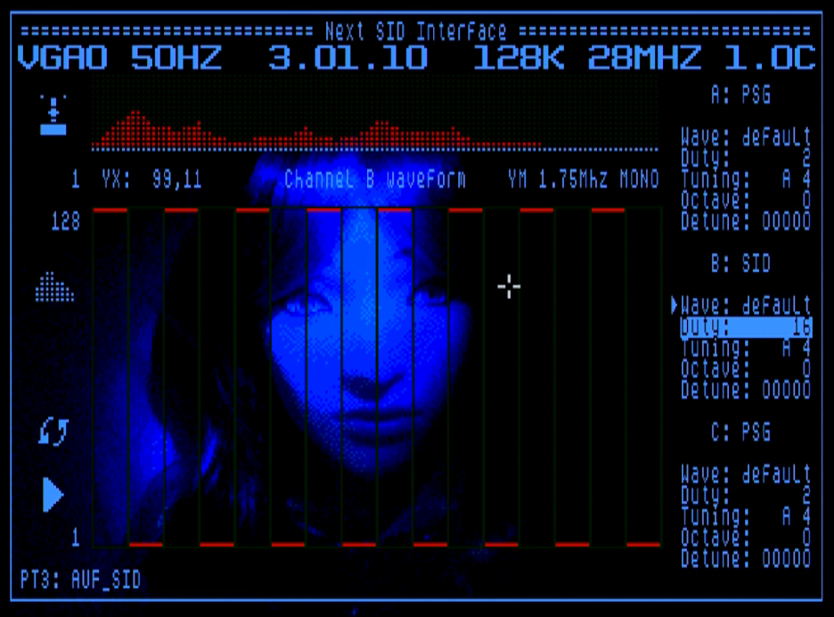

# NextSID
 AtariSID like engine for the ZX Next

 NextSID engine coded by 9BitColor

 Here you will find two players containing an engine for playing back PT3 files that allows you to apply custom duty cycles on the AY channels to produce a SID like sounds.

 See 9BitColor's readme inside the NexSIDi folder for more details. !9BitColor's ReadMe](NextSIDi/NextSIDi-v1.0c.txt)

 **NextSIDPlayer was written by em00k 1.0**

 This is a general player that allows you to load PT3 files from SD. You can then set the parameters and save an "NT3" file, this holds the custom params for that particluar song. When you load a PT3 file if an NT3 exists the parameters are automatically loaded. 
 
 You will require a mouse to use thie player. Click Load PT3 and enter the PT3 folder. Once you click a tune it will load and begin player. To return back the main screen RIGHT CLICK. 
 All the songs include have an NT3 of the same name and this will be automatically loaded and set the parameters. When you click Load NT3 it will load this config file again. When you wish to make changes you can do so by clicking "Save NT3". If you make a huge mess simply click "Reset" to reset the params. 

**NextSID Interface was written by 9BitColor 1.0c**
 

 This is an all in one with a selection of tunes baked in, if you click on the version number an inbuilt help document will explain more. 

